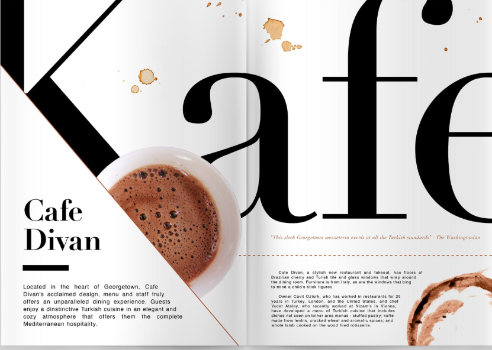

# Atomic Design

Gambar ini menunjukkan **reaksi kimia pembentukan air (H₂O)** dari gas **hidrogen (H₂)** dan **oksigen (O₂)**

<figure><figcaption></figcaption></figure>

Gambar ini bukan cuma menggambarkan reaksi kimia, tapi juga menunjukkan bagaimana **kompleksitas struktur molekul** muncul dari **komponen sederhana**, seperti halnya desain antarmuka bisa dibangun dari elemen-elemen kecil yang saling terhubung.

* **Atom**\
  Atom adalah **unit dasar dari semua materi**. Setiap unsur kimia punya sifat yang unik dan tidak bisa dipecah lagi tanpa kehilangan identitasnya.\
  (Meskipun atom terdiri dari partikel yang lebih kecil seperti proton, neutron, dan elektron, atom tetap dianggap sebagai unit fungsional terkecil.)
* **Molekul**\
  Molekul adalah **gabungan dari dua atau lebih atom** yang terikat melalui ikatan kimia.\
  Saat atom bergabung, mereka membentuk entitas baru dengan **sifat yang berbeda dan lebih nyata** dibandingkan atom-atom terpisah.
* **Organisme**\
  Organisme adalah **gabungan dari berbagai molekul** yang bekerja bersama sebagai satu kesatuan.\
  Organisme bisa sesederhana satu sel, atau serumit manusia dan makhluk hidup lainnya.

<figure><figcaption></figcaption></figure>

## **Metodologi Atomic Design**

Mungkin ada yg bertanya-tanya, _“Kenapa kita  ngomongin teori atom?”_ Bahkan  kembali ke pelajaran kimia SMA.&#x20;

Sebelumnya kita sudah bahas bahwa **semua materi di alam semesta** bisa dipecah menjadi **sejumlah elemen dasar (atom)** yang terbatas. Nah, menariknya, **antarmuka digital** (seperti website atau aplikasi) juga bisa dipecah menjadi **komponen-komponen dasar** yang jumlahnya terbatas.

Desainer **Josh Duck** bahkan pernah membuat sesuatu yang disebut **Tabel Periodik Elemen HTML**, yang menunjukkan bahwa **semua website, aplikasi, intranet, atau apapun bentuk digital lainnya sebenarnya dibangun dari elemen HTML yang sama**—seperti `<button>`, `<input>`, `
`, `<h1>`, dan seterusnya.

<figure><figcaption></figcaption></figure>

Sama seperti **atom membentuk molekul dan organisme**, kita bisa membangun antarmuka:

* dari elemen HTML paling dasar (atom),
* menjadi kombinasi elemen (molekul),
* hingga menjadi komponen fungsional yang kompleks (organisme dan halaman)

Dengan memahami dan menggunakan **metodologi atomic design**, kita bisa menciptakan sistem desain yang **konsisten, modular, dan mudah dikelola**.

## Apa itu _Atomic Design_?

**Atomic Design** adalah sebuah **metodologi desain** yang terdiri dari **lima tahapan utama** yang saling berkaitan. Metode ini membantu kita membuat sistem desain antarmuka yang **lebih terstruktur, konsisten, dan mudah dikembangkan**.

Kelima tahapannya adalah:

**1. Atoms (Atom)**

> Elemen UI terkecil dan paling dasar.

Contoh:

* Tag HTML seperti `<button>`, `<label>`, `<input>`
* Warna, font, dan icon tunggal

***

**2. Molecules (Molekul)**

> Gabungan dari dua atau lebih atom yang bekerja bersama sebagai satu fungsi.

Contoh:

* Label + input + tombol = form field kecil

***

**3. Organisms (Organisme)**

> Sekumpulan molekul (dan mungkin atom) yang membentuk bagian fungsional dari UI.

Contoh:

* Header dengan logo, menu navigasi, dan tombol pencarian
* Card produk dengan gambar, judul, dan tombol beli

***

**4. Templates (Template)**

> Rangka desain halaman berbasis struktur. Template menampilkan **layout** dan bagaimana organisme ditempatkan.

Contoh:

* Layout homepage, halaman artikel, atau dashboard

***

**5. Pages (Halaman)**

> Versi nyata dari template dengan **konten nyata**. Di sinilah kita melihat bagaimana sistem desain benar-benar tampil dan digunakan.

Contoh:

* Halaman “Tentang Kami” yang berisi teks dan gambar asli, bukan dummy

<figure><figcaption></figcaption></figure>

Dengan _Atomic Design_, kita membangun antarmuka layaknya membangun dari LEGO—mulai dari kepingan kecil yang bisa disusun ulang dan dipakai kembali. Hasilnya:

* Konsistensi desain
* Pengembangan lebih cepat
* Lebih mudah diuji dan dikelola
